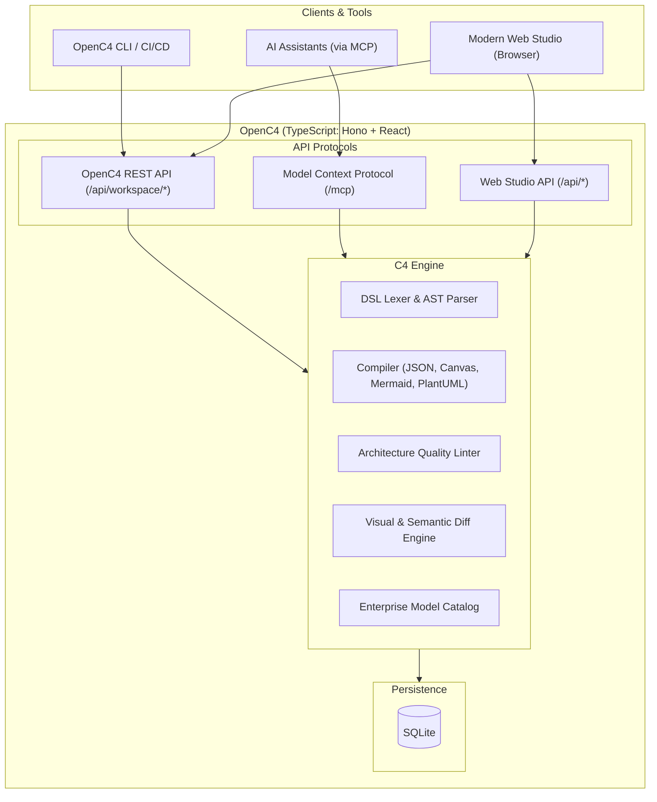

# OpenC4 — Open Source C4 Architecture Tool

**OpenC4** is an open source C4 architecture tool designed to model, visualize, and document software architecture using the [C4 model](https://c4model.com/). It provides an interactive web-based studio, real-time diagram generation, and enterprise collaboration features while maintaining complete compatibility with ecosystem standards such as **Structurizr**, **Mermaid**, and **PlantUML**.

---

## Why OpenC4?

Modern software engineering requires architecture diagrams that are versionable, automated, and easy for both humans and AI tools to understand. OpenC4 acts as a unified open source hub for architecture-as-code:

1. **Live Split-Screen Studio**: Monaco DSL editor with syntax highlighting, auto-completion, and sub-50ms live diagram rendering.
2. **Interactive C4 Canvas**: Fluid React Flow canvas with pan, zoom, minimap, smart Dagre auto-layout, and drag-and-drop coordinate persistence.
3. **Deep C4 Drill-Down**: Double-click any System to drill down into Containers, and Containers to drill down into Components.
4. **Broad Compatibility**: Native compatibility with **Structurizr** DSL and CLI, seamless export to **Mermaid** and **PlantUML**, and exchange via standard JSON.
5. **Enterprise Model Catalog**: Publish software systems to an organization-wide catalog and reference shared systems across distinct workspaces.
6. **Publishing & Visual Diffing**: Versioned release lifecycles (`Draft` → `Published`) with visual diffs highlighting added, modified, and removed elements.
7. **Native Model Context Protocol (MCP)**: Built-in `/mcp` JSON-RPC endpoint allowing AI assistants (Gemini, Claude, ChatGPT) to validate, inspect, query, and generate models.
8. **Architecture Quality Linter**: Automated rule checker identifying orphaned elements, missing descriptions, or untyped technologies.
9. **Multi-Format Export**: One-click export to Mermaid, C4-PlantUML, Structurizr JSON, SVG, PNG, and Structurizr DSL.

---

## Architecture Overview



---

## Compatibility & Interoperability

OpenC4 is built to fit smoothly into existing engineering workflows and documentation stacks:

### Structurizr Compatibility
- **Structurizr DSL**: Full parsing and compilation of workspaces defined in the Structurizr DSL.
- **`structurizr-cli` & REST API**: Native implementation of the Structurizr Web API (`/api/workspace/{id}`), enabling drop-in compatibility with `structurizr-cli push` and `structurizr-cli pull` in CI/CD pipelines.
- **Structurizr JSON**: Full import and export compatibility conforming to Structurizr JSON schemas.
- **Structurizr MCP**: Built-in support for the Structurizr Model Context Protocol specification for AI agents.

### Mermaid Compatibility
- **Mermaid Export**: One-click export of C4 Context, Container, and Component views into standard Mermaid diagram syntax.
- **Git & Markdown Native**: Embed exported Mermaid diagrams directly into GitHub/GitLab READMEs, pull requests, wikis, Notion, and documentation sites (VitePress, Docusaurus, MkDocs).

### PlantUML & Other Formats
- **C4-PlantUML**: Export diagrams in C4-PlantUML syntax for legacy documentation pipelines.
- **Vector & Raster Images**: Export high-resolution SVG and PNG diagrams for presentations and documentation.

---

## Quick Start

### Option 1: Run Locally (Node.js / TypeScript)

1. **Start the application:**
   ```bash
   ./run.sh
   ```
   Open your browser to [http://localhost:8000](http://localhost:8000).

2. **Backend Development Mode:**
   ```bash
   npm --prefix backend run dev
   ```

### Option 2: Docker Compose

```bash
docker compose up --build
```

---

## Using `structurizr-cli` with OpenC4

Because OpenC4 implements the Structurizr Web API specification, you can push or pull workspaces directly using `structurizr-cli`:

```bash
# Push an existing workspace.dsl
structurizr-cli push -url http://localhost:8000/api -id 1 -key <API_KEY> -secret <API_SECRET> -workspace workspace.dsl

# Pull a workspace JSON
structurizr-cli pull -url http://localhost:8000/api -id 1 -key <API_KEY> -secret <API_SECRET>
```

API keys and secrets can be viewed or regenerated in the Web Studio or via:
`POST /api/workspace/{id}/apikey/regenerate`

---

## Model Context Protocol (MCP) Integration

OpenC4 provides a built-in MCP server at `POST /mcp` compatible with the Structurizr MCP specification. AI agents can invoke:

* `validate_dsl`: Validates Structurizr DSL syntax and returns AST metrics or error locations.
* `inspect_workspace`: Runs automated quality checks and returns rule findings.
* `export_diagram`: Exports diagrams to Mermaid, C4-PlantUML, or Structurizr JSON.
* `query_model`: Searches systems, containers, components, and relationships.

---

## Verification & Testing

To run the automated test suite:

```bash
npm --prefix backend test
```

---

## License

OpenC4 is open-source software licensed under the [MIT License](LICENSE).

