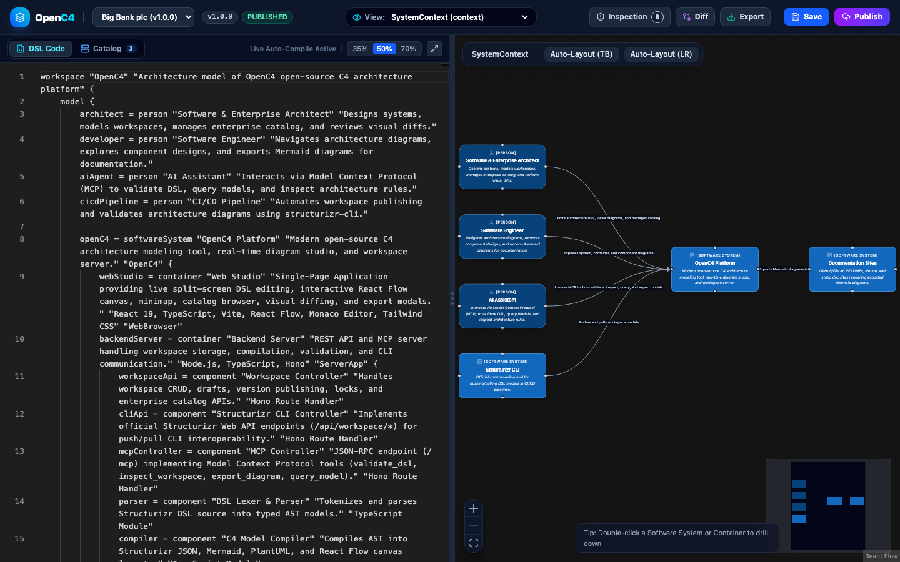
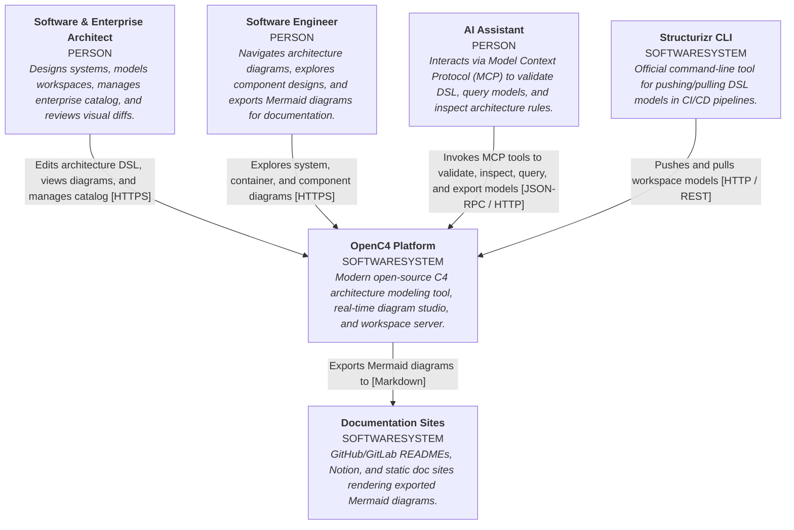
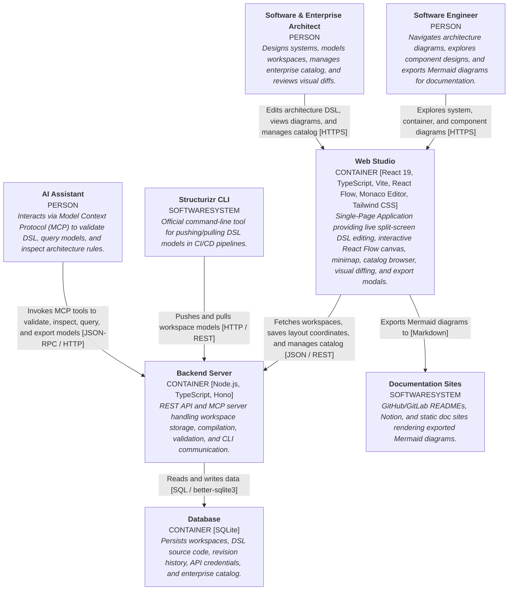
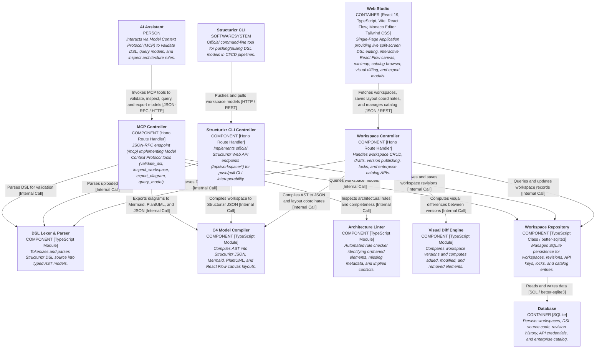

# OpenC4 — Open Source C4 Architecture Tool

> [!WARNING]
> ### 🚧 Prototype — Work in Progress
> **OpenC4 is currently an early-stage prototype under active development.** Core features, APIs, and DSL specifications are evolving rapidly. Feedback, issue reports, and contributions are warmly welcomed!

**OpenC4** is an open source C4 architecture tool designed to model, visualize, and document software architecture using the [C4 model](https://c4model.com/). It provides an interactive web-based studio, real-time diagram generation, and enterprise collaboration features while maintaining complete compatibility with ecosystem standards such as **Structurizr**, **Mermaid**, and **PlantUML**.

<p align="center">
  
</p>

---

## Why OpenC4?

Modern software engineering requires architecture diagrams that are versionable, automated, and easy for both humans and AI tools to understand. OpenC4 acts as a unified open source hub for architecture-as-code:

1. **Live Split-Screen Studio**: Monaco DSL editor with syntax highlighting, auto-completion, and sub-50ms live diagram rendering.
2. **Modular Multi-File Workspaces (`!include`)**: Split complex enterprise architectures across modular files and directories (`people.dsl`, `systems/payments.dsl`). Real-time preprocessor resolves relative paths, directory includes (`!include <dir/>`), and circular dependency detection with exact 1-to-1 error line mapping.
3. **Interactive File Explorer & Drag-and-Drop**: Full file hierarchy with folders, inline creation, renaming, deletion, and drag-and-drop file organization. Dragging a file into a folder automatically refactors corresponding `!include` statements in `workspace.dsl`.
4. **Interactive C4 Canvas**: Fluid React Flow canvas with pan, zoom, minimap, smart Dagre auto-layout, and drag-and-drop coordinate persistence.
5. **Deep C4 Drill-Down**: Double-click any System to drill down into Containers, and Containers to drill down into Components.
6. **Broad Compatibility**: Native compatibility with **Structurizr** DSL and CLI, seamless export to **Mermaid** and **PlantUML**, and exchange via standard JSON.
7. **Enterprise Model Catalog**: Publish software systems to an organization-wide catalog and reference shared systems across distinct workspaces.
8. **Publishing & Visual Diffing**: Versioned release lifecycles (`Draft` → `Published`) with visual diffs highlighting added, modified, and removed elements.
9. **Native Model Context Protocol (MCP)**: Built-in `/mcp` JSON-RPC endpoint allowing AI assistants (Gemini, Claude, ChatGPT) to validate, inspect, query, and generate models.
10. **Architecture Quality Linter**: Automated rule checker identifying orphaned elements, missing descriptions, or untyped technologies.
11. **Multi-Format Export**: One-click export to Mermaid, C4-PlantUML, Structurizr JSON, SVG, PNG, and Structurizr DSL.

---

## Architecture Overview

The OpenC4 architecture is modeled and validated using OpenC4's own Model Context Protocol (MCP) server. See [`openc4.dsl`](openc4.dsl) and the [`architecture/`](architecture/) directory for all model files and schemas.

### 1. System Context Diagram
Shows how architects, developers, and AI agents interact with the OpenC4 platform and external tools:



### 2. Container Diagram
Illustrates the internal containers: Web Studio (React + React Flow + Monaco), Backend Server (Node.js + Hono), and SQLite database:



### 3. Backend Component Diagram
Shows the modular components inside the OpenC4 backend server:



---

## Multi-File Workspace Management & Modular DSL

Large enterprise architectures quickly become unmanageable inside a single monolithic `workspace.dsl` file. OpenC4 provides native support for modular architectures across multiple files and folders using the Structurizr `!include` directive, allowing teams and multiple developers to collaborate without file collisions.

### How It Works

1. **Root Entry Point (`workspace.dsl`)**:
   Every workspace has a pinned `workspace.dsl` entry point that configures the workspace definition, global views, and includes modular child files:
   ```structurizr
   workspace "Banking Platform" "Modular enterprise C4 architecture." {
       model {
           !include people.dsl
           !include systems/payment.dsl
           !include systems/accounts.dsl
       }

       views {
           systemContext paymentSystem "PaymentContext" {
               include *
               autoLayout lr
           }
       }
   }
   ```

2. **Modular Child Files (`systems/payment.dsl`)**:
   Domain teams maintain their own isolated DSL files:
   ```structurizr
   // systems/payment.dsl
   paymentSystem = softwareSystem "Payment Service" "Processes credit card & ACH transactions." {
       api = container "Payment API" "RESTful API handling charge requests." "Node.js / Express"
       db = container "Payment Database" "Stores transactions and ledger records." "PostgreSQL"
       api -> db "Reads and writes"
   }
   customer -> paymentSystem "Makes payments with"
   ```

3. **Folder Inclusion (`!include <dir/>`)**:
   Include all `.dsl` files in a directory automatically:
   ```structurizr
   model {
       !include systems/
   }
   ```

### Interactive File Explorer & Drag-and-Drop

The OpenC4 Studio includes an interactive File Explorer sidebar directly to the left of the editor:

- **Clean Folder Management**: Create organizational folders (e.g. `systems`, `components`, `people`) without generating dummy files (`index.dsl` is never created). Empty folders show an intuitive drop target.
- **Drag-and-Drop File Organization**:
  - Drag files into any folder to move them into subdirectories.
  - When dragging any nested file, an obvious drop target appears (`Drop here to move to root`) to move files back to the workspace root.
  - **Automatic `!include` Refactoring**: Moving a file (e.g. `mcpcomponent.dsl` $\rightarrow$ `backend/mcpcomponent.dsl`) automatically updates any corresponding `!include` statements across the workspace.
- **Multi-Tab Editor & State Preservation**:
  - Edit multiple files concurrently with dedicated tabs above the Monaco editor.
  - In-memory unsaved edits are preserved across tab switches without loss.
  - Dirty state indicators (`•`) track uncommitted changes.
- **Precision Error Line Mapping**:
  - If a syntax or semantic error occurs in an included file, the preprocessor maps the error back to the originating file and line.
  - Clicking the error banner jumps directly to the file and focuses the exact offending line.

---

## Compatibility & Interoperability

OpenC4 is built to fit smoothly into existing engineering workflows and documentation stacks:

### Structurizr Compatibility
- **Structurizr DSL**: Full parsing and compilation of workspaces defined in the Structurizr DSL, including multi-file `!include` preprocessing (relative paths, directory includes, and circular dependency checks).
- **`structurizr-cli` & REST API**: Native implementation of the Structurizr Web API (`/api/workspace/{id}`), enabling drop-in compatibility with `structurizr-cli push` and `structurizr-cli pull` in CI/CD pipelines. All modular files are compiled into `dsl_source` for complete backward compatibility.
- **Structurizr JSON**: Full import and export compatibility conforming to Structurizr JSON schemas.
- **Structurizr MCP**: Built-in support for the Structurizr Model Context Protocol specification for AI agents.

### Mermaid Compatibility
- **Mermaid Export**: One-click export of C4 Context, Container, and Component views into standard Mermaid diagram syntax.
- **Git & Markdown Native**: Embed exported Mermaid diagrams directly into GitHub/GitLab READMEs, pull requests, wikis, Notion, and documentation sites (VitePress, Docusaurus, MkDocs).

### PlantUML & Other Formats
- **C4-PlantUML**: Export diagrams in C4-PlantUML syntax for legacy documentation pipelines.
- **Vector & Raster Images**: Export high-resolution SVG and PNG diagrams for presentations and documentation.

---

## Quick Start

### Option 1: Run Locally (Node.js / TypeScript)

1. **Start the application:**
   ```bash
   ./run.sh
   ```
   Open your browser to [http://localhost:8000](http://localhost:8000).

2. **Backend Development Mode:**
   ```bash
   npm --prefix backend run dev
   ```

### Option 2: Docker Compose

```bash
docker compose up --build
```

---

## Using `structurizr-cli` with OpenC4

Because OpenC4 implements the Structurizr Web API specification, you can push or pull workspaces directly using `structurizr-cli`:

```bash
# Push an existing workspace.dsl
structurizr-cli push -url http://localhost:8000/api -id 1 -key <API_KEY> -secret <API_SECRET> -workspace workspace.dsl

# Pull a workspace JSON
structurizr-cli pull -url http://localhost:8000/api -id 1 -key <API_KEY> -secret <API_SECRET>
```

API keys and secrets can be viewed or regenerated in the Web Studio or via:
`POST /api/workspace/{id}/apikey/regenerate`

---

## Model Context Protocol (MCP) Integration

OpenC4 provides a built-in MCP server at `POST /mcp` compatible with the Structurizr MCP specification. AI agents can invoke:

* `validate_dsl`: Validates Structurizr DSL syntax and returns AST metrics or error locations.
* `inspect_workspace`: Runs automated quality checks and returns rule findings.
* `export_diagram`: Exports diagrams to Mermaid, C4-PlantUML, or Structurizr JSON.
* `query_model`: Searches systems, containers, components, and relationships.

---

## Verification & Testing

To run the automated test suite:

```bash
npm --prefix backend test
```

---

## License

OpenC4 is open-source software licensed under the [MIT License](LICENSE).

